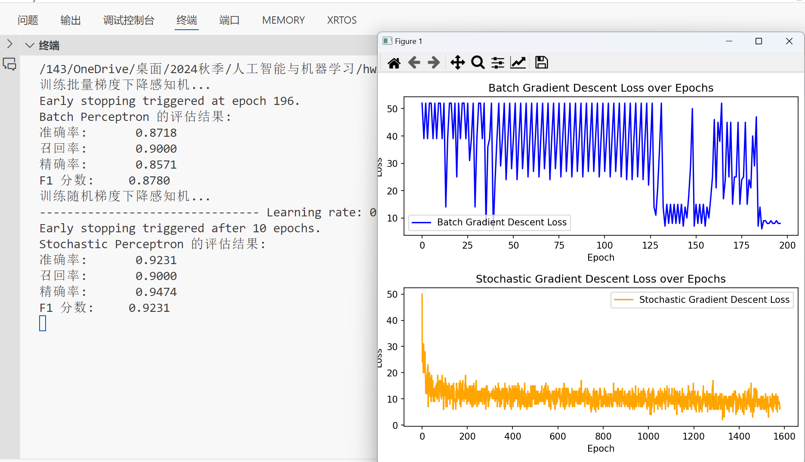

 ## Conclusion
### 1. Labels should be set to 1 and -1
In the Perceptron algorithm, labels need to be set to 1 and -1 instead of 0 and 1. If you use 0 and 1, the model won't function correctly as it relies on the sign of the dot product between weights and features to make decisions. This mismatch can lead to improper updates and poor performance.

### 2. Tolerance should not be set too small
The tolerance (tol) parameter controls when the model should stop iterating if the improvement in loss is minimal. Setting tol too small (e.g., 1e-6 or smaller) can prevent the model from converging in a reasonable amount of time. A reasonable tol (like 1e-3 or 1e-4) ensures quicker convergence without overfitting or unnecessarily long training times.

### 3. Learning rate (lr) for SGD should be larger than for BGD
SGD (Stochastic Gradient Descent) typically requires a higher learning rate than BGD (Batch Gradient Descent) because SGD updates weights more frequently and tends to be noisier. If lr is too small in SGD, convergence will be slow or might not happen. A typical range for BGD might be 0.01, while for SGD, it could be 0.1 or even larger.

## Experiment Results

