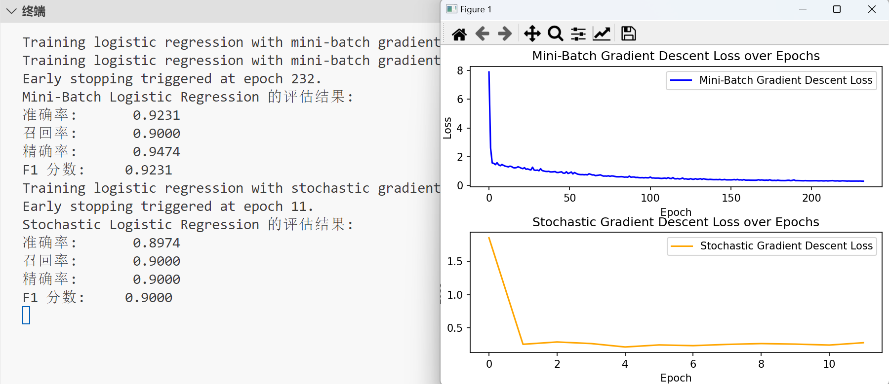

## The difference between perceptron and logistic regression model.
1. perceptron只适用于线性可分的数据集，因为其只会找到超平面来分割数据；logistic regression 则适用于线性不可分的数据集，因为其通过最大化对数似然估计，预测样本属于某个类别的概率   
2. Perceptron Loss只考虑被误分类的样本，损失函数为$L(\mathbf{w}) = -\sum_{i} y_i \mathbf{w}^T \mathbf{x}_i$，通过调整权重来尽可能减少误分类数；  
Cross-Entropy Loss考虑Predicted Probability和Real Label间的差距，$L(\mathbf{w}) = -\sum_{i} \left[y_i \log p_i + (1 - y_i) \log (1 - p_i)\right]$通过最大化对数似然估计来训练参数
3. perceptron的损失函数是误分类损失，只有线性可分的情况下才保证收敛，更新方向会有明显的跳跃，导致需会要更多次的迭代，lr设置的也会比logistic regression大；  
logistic regression使用Sigmoid 函数将输出映射到概率空间，从而产生一个平滑的损失曲线，即使数据线性不可分也能处理，梯度变化相对平稳，lr可以设置的较小，且更易收敛。但由于指数函数的存在，如果lr设置的过大会导致溢出

4. 感知机输出的是一个类别标签；逻辑回归通过 Sigmoid 函数将结果映射到 (0, 1) 之间，输出的是样本属于某个类别的概率。

## Experiment Results

