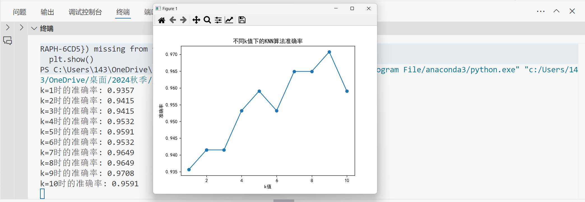

The results show that as k increases from 1 to 10, the accuracy generally improves, peaking at k=9 with an accuracy of 0.9708. Lower k values (like k=1) tend to overfit due to sensitivity to noise, while higher k values (like k=10) show a slight drop in accuracy, likely due to underfitting as the model smooths out and loses some detail. The optimal k in this range is 9, balancing accuracy without overfitting or underfitting.

