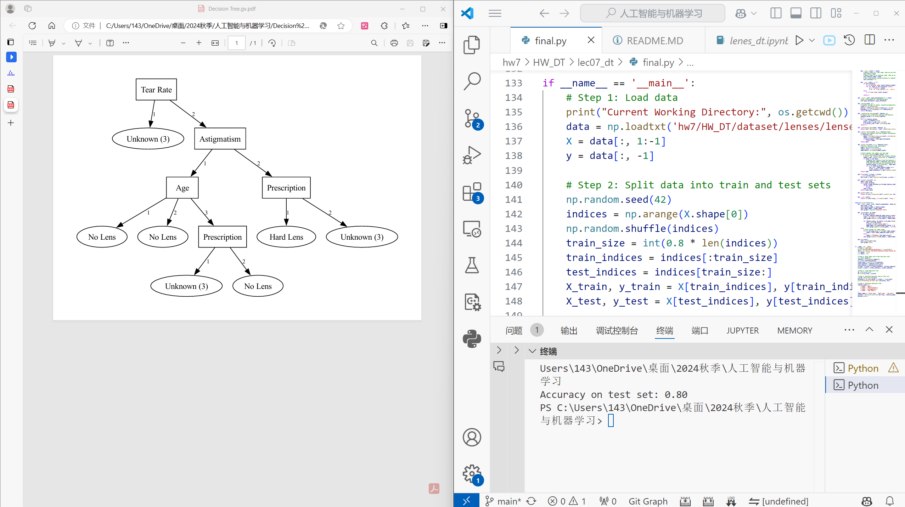

During the execution of the decision tree visualization code, the accuracy on the test set was 0.80. To resolve issues with the Graphviz environment, the software was downloaded and installed from Graphviz Official Site using the executable version. The installation process included setting up the system PATH to ensure the dot executable could be accessed.

