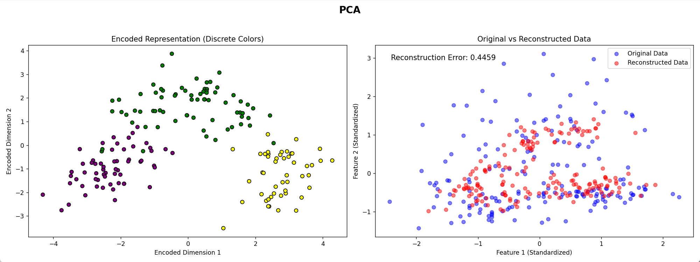

# Analysis of Model Performance

## Reconstruction Errors
- **Linear Autoencoder**
  - Reconstruction Error: **0.4096**
- **Nonlinear Autoencoder**
  - Reconstruction Error: **0.4910**
- **PCA (Principal Component Analysis)**
  - Reconstruction Error: **0.4459**

##  Comparison 
### **Linear Autoencoder**
- The overlap between original data (blue points) and reconstructed data (red points) is substantial.
- The model retains linear data structure effectively, with the lowest reconstruction error of **0.4096**.

### **Nonlinear Autoencoder**

- Some reconstructed points deviate significantly. This may be due to the complexity of the model or the fact that the data itself is relatively linear, limiting the nonlinear model's strengths.
- Reconstruction error is slightly higher at **0.4910**.
- The loss curve shows that the loss only drops significantly at very large epochs. This indicates that a high number of epochs is necessary for the model to converge effectively. If the number of epochs is insufficient, the model performs poorly.

### **PCA**
- The overlap between original and reconstructed data is moderate.
- Reconstruction performance is less accurate than the Linear Autoencoder but better than the Nonlinear Autoencoder.
- Reconstruction error is **0.4459**, as PCA is limited to linear transformations.

## Conclusion
1. **Linear Autoencoder**:
   - Lowest reconstruction error, making it suitable for tasks requiring high fidelity in data reconstruction.

2. **Nonlinear Autoencoder**:
   - While its reconstruction error is the highest, it captures nonlinear features better. However, its class separation is the weakest, with significant overlap among different classes.
   - Recommended for complex or nonlinear data distributions, such as clustering or classification tasks.

3. **PCA**:
   - Computationally efficient and provides moderate reconstruction quality.
   - Both PCA and Linear Autoencoder produce more concentrated reconstructed data points compared to the Nonlinear Autoencoder.
   - A good choice for quick dimensionality reduction in linearly distributed data.

## Github

[View the code on GitHub](https://github.com/POLARbearwow/AI-and-Machine-Learning-Fall-2024/tree/main/hw9)
